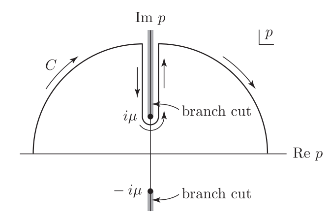
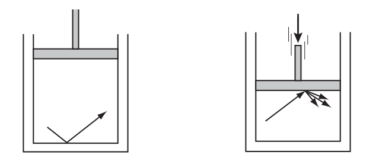

 

# 量子场论Quantum Field Theory

{ width=90% height=auto }

**参考书目**

## Lecture 1. 往量子力学里加入狭义相对论

### 1.1 引言

#### 引入相对论的必要性

在$E\geq mc^2$的能级上，会发生反应$p+p\rightarrow p+p+\pi^0$，在更高能级上，会发生：$p+p\rightarrow p+p+p+\bar{p}$，此时相对论效应显著，量子力学不能够准确预测结果。

那么也许在低能态下可以不用考虑相对论效应？考虑对$H$的微扰$\delta V$，微扰论告诉我们能量的一阶微扰项为：$$\delta E_0=\bra{0}\delta V\ket{0}+\sum_n\cfrac{|\bra{0}\delta V\ket{n}|^2}{E_0-E_n}$$

这个表达式中含有$E_n$，涉及所有可能的能级，自然包括那些相对论能级。对于低能量的高精度计算，考虑相对论效应是合理的；同时，有额外粒子的Intermediate states也会贡献$(v/c)^2$量级的修正量。总之，相对论修正和多体中间态的修正具有相同量级，**相对论迫使我们考虑多体问题**。

#### 符号规定

我们规定$$\hbar=c=1$$

这个规定下有一个自由度，从量纲的角度来说：$$[m]=[E]=[T]^{-1}=[L]^{-1}$$

此外有：$$(1\ {\rm fermi})^{-1}\approx 197{\rm MeV},\ m_e\approx0.5{\rm MeV}=7.8\times10^{20}{\rm s^{-1}}=2.6\times10^{10}{\rm cm^{-1}}$$

#### 洛伦兹不变性

我们的物理建立在**闵可夫斯基空间**上，这是一个平坦的四维时空，我们可以写下坐标：$$x^\mu=(x^0,x^1,x^2,x^3)=(t,\mathbf{x})$$

和四维动量：$$p^\mu=(p^0,\mathbf{p})=(\varepsilon,\bf{p})$$

>由于$\hbar=1$，我们有$p=k$，其中$k^0=\omega$。

在空间中，任一**逆变矢量**$a^\mu$可被写成$a^\mu=(a^0,a^i)=(a^0,\mathbf{a})$
与之相应的**协变矢量**$a_\mu=(a_0,a_i)=(a^0,-\mathbf{a})$
故两者内积为：$$a\cdot b\equiv a^\mu b_\mu=a_\mu b^\mu=a^0b_0+a^1b_1+a^2b_2+a^3b_3=a^0b^0-\mathbf{a}\cdot\mathbf{b}$$

其中$\mathbf{a}\cdot\mathbf{b}$为三维空间的内积。

>我们在这里采用爱因斯坦求和约定并将沿用，在该规定下，重复指标代表求和

内积是**洛伦兹不变量**，也可以被写成$g_{\mu\nu}a^\mu b^\nu$的形式。在此之上得到：$$g=\begin{pmatrix}
  1 & 0 & 0 & 0 \\
  0 & -1 & 0 & 0 \\
  0 & 0 & -1 & 0 \\
  0 & 0 & 0 & -1 \\
\end{pmatrix}$$

>采用$(+---)$度规符号

注意到：$$\begin{aligned}g_{\mu\nu}A^\nu&=A_\mu\\g_{\mu\lambda}g^{\lambda\nu}&=\delta^\nu_\mu\end{aligned}$$

洛伦兹变换可由一个$4\times 4$矩阵$\Lambda^\mu_\nu$表示，更进一步有：$$\Lambda:x^\mu\rightarrow x'^\mu=\Lambda^\mu_\nu x^\nu\equiv\Lambda x$$

由内积的洛伦兹不变性，我们有：$$\Lambda a\cdot \Lambda b=a\cdot b$$

洛伦兹变换形成一个群，我们称之为${\rm O}(3,1)$。$O$表示正交群，$(3,1)$表示它并非一个经典正交群，因为其位于闵可夫斯基空间中，其空间量和时间量具有不同的符号。

实际上，这个群对我们要讨论的内容来说太大了，因为其包括了一些“不自然”的变换：宇称反转和时间反转。我们在这里的讨论局限于连通的(connected)洛伦兹群，其中的群元可以通过连续变化从恒等式中得到。我们把这一类群称为$SO(3,1)$，其中$S$意味着“special”，群元的矩阵表示的行列式为1。

完整洛伦兹群的元素可以写为$SO$群元和以下集合作用的结果：$\{1,P,T,PT\}$，其中：$$\begin{aligned}P&:\mathbf{x}\rightarrow-\mathbf{x}\\T&:t\rightarrow-t\end{aligned}$$
>当我们说洛伦兹不变，我们一般指$SO(3,1)$的不变性

在洛伦兹群作用下，我们可以把矢量分为三类：**类时**、**类空**、**类光**。矢量$a^\mu$的分类取决于$a^2$的正负。
>考虑矢量$x$和$y$，那么可以定义其间隔$(x-y)^2=(x^\mu-y^\mu)(x_\mu-y_\mu)$，其也是洛伦兹不变量

>实际上世界应该由一个包含齐次(homogeneous)洛伦兹群和时空平移的更大的群来描述，我们称之为庞加莱群。

#### 关于积分、微分和特殊函数的约定

基本的微分算符可以定义为：$$\partial_\mu=\cfrac{\partial}{\partial x^\mu}=\bigg(\cfrac{\partial}{\partial x^0},\cfrac{\partial}{\partial x^i}\bigg)=\bigg(\cfrac{\partial}{\partial t},\nabla\bigg)$$

它是一个协变矢量，满足：$$\partial_\nu x^\mu=\cfrac{\partial x^\mu}{\partial x^\nu}=\delta^\mu_\nu$$

如果我们把算符和坐标都表为下指标，那么有：$$\partial_\nu x_\mu=\cfrac{\partial x_\mu}{\partial x^\nu}=\cfrac{\partial x^0}{\partial x^\nu}-\cfrac{\partial x^i}{\partial x^\nu}=g^\mu_\nu$$

进一步，我们有洛伦兹不变算符$\partial^2$记为$\Box^2$：$$\Box^2=\partial^2=\partial^\mu\partial_\mu=(\partial^0)^2-\nabla^2$$

现在看积分，对一个$a^\mu$的四个分量积分，我们有：$$\int d^4a=\int^\infty_{-\infty}da^0\int^\infty_{-\infty}da^1 \int^\infty_{-\infty}da^2 \int^\infty_{-\infty}da^3$$

>用$\delta^{(3)}(\mathbf{x})$表示三维的delta函数，$\delta^{(4)}(x)$表示四维delta函数。

>定义四维时空上函数$F(x)$的傅里叶变换函数$$\begin{aligned}\tilde{F}(k)&=\int d^4xF(x)e^{ik\cdot x}\\F(x)&=\int \cfrac{d^4k}{(2\pi)^4}\tilde{F}(k)e^{-ik\cdot x}\end{aligned}$$

>定义函数$\theta(x)$:$$\theta(x)=\begin{cases}1,\ {\rm if}\ x>0\\0,\ {\rm if}\ x<0\end{cases}$$$$\cfrac{d\theta}{dx}=\delta(x)$$

### 1.2 无自旋自由单粒子（质量为$\mu$）的理论

#### 理论构建

无自旋粒子态完全由动量决定，并且动量的分量构成了一组完备的交换变量(commuting variables)：$$\mathbf{P}\ket{\mathbf{p}}=\mathbf{p}\ket{\mathbf{p}}$$

本征矢**归一化关系**为：$$\braket{\mathbf{p}|\mathbf{p'}}=\delta^{(3)}(\mathbf{p}-\mathbf{p'})$$

**完备性关系**为：$$1=\int d^3\mathbf{p}\ket{\mathbf{p}}\bra{\mathbf{p}}$$

态函数$\ket{\psi}$可以被动量本征矢展开：$$\ket{\psi}=\int d^3\mathbf{p}\psi(\mathbf{p})\ket{\mathbf{p}}$$

其中$\psi(\mathbf{p})\equiv \braket{\mathbf{p}|\psi}$。如果是非相对论性量子力学，现在只需要考虑$H=|\mathbf{p}|^2/2\mu$，然后由薛定谔方程给出态的随时演化：$$H\ket{\mathbf{p}}=\cfrac{|\mathbf{p}|^2}{2\mu}\ket{\mathbf{p}}$$

但对于相对论性量子力学，我们由**质能方程**定义能量，采用：$$H\ket{\mathbf{p}}=\sqrt{|\mathbf{p}|^2+\mu^2}\ket{\mathbf{p}}\equiv\omega_\mathbf{p}\ket{\mathbf{p}}$$

这就是无自旋自由单粒子的相对论性动力学方程。**首先，我们注意到方程是显然旋转和平移不变的。然后，我们证明这个方程是洛伦兹不变的。**

#### 平移不变性

首先考虑平移，对于一个给定的矢量$a^\mu$，应该有一个**线性算符**$U(a)$满足条件：$$\begin{aligned}U(a)U(a)^\dagger&=1\\U(0)&=1\\U(a)U(b)&=U(a+b)\end{aligned}$$

满足这些条件的算符$U$具有这样的形式：$U(a)=e^{iP\cdot a}$，其中$P^\mu=(H,\mathbf{P})$

矢量被$U$变换形式如下：$$U(a)\ket{0}=\ket{a}$$

其中$\ket{x}$代表中心在$x$的态函数。算符$O$的变换形式为：$$O(x+a)=U(a)O(x)U(a)^\dagger$$

由上式可以推出期望值在变换下守恒，满足：$$\bra{a}O(x+a)\ket{a}=\bra{0}O(x)\ket{0}$$

如果只考虑空间变换，我们有：$$\begin{aligned}U(a)&=e^{-i\mathbf{P}\cdot\mathbf{a}}\\ e^{-i\mathbf{P}\cdot\mathbf{a}}\ket{\mathbf{q}}&=\ket{\mathbf{q}+\mathbf{a}}\\e^{-i\mathbf{P}\cdot\mathbf{a}}O(\mathbf{x})e^{i\mathbf{P}\cdot\mathbf{a}}&=O(\mathbf{x}+\mathbf{a})\end{aligned}$$

需要注意，只有依赖于坐标的算符满足这样的规则，对于位置算符本身，则满足：$$\begin{aligned}\mathbf{\hat{q}}e^{-i\mathbf{P}\cdot\mathbf{a}}\ket{\mathbf{q}}&=(\mathbf{q}+\mathbf{a})\ket{\mathbf{q}+\mathbf{a}}\\ e^{i\mathbf{P}\cdot\mathbf{a}}\mathbf{\hat{q}}e^{-i\mathbf{P}\cdot\mathbf{a}}\ket{\mathbf{q}}&=(\mathbf{q}+\mathbf{a})\ket{\mathbf{q}}\\ \Rightarrow e^{i\mathbf{P}\cdot\mathbf{a}}\mathbf{\hat{q}}e^{-i\mathbf{P}\cdot\mathbf{a}}&=\mathbf{\hat{q}}+\mathbf{a}\end{aligned}$$

>如果从逻辑顺序考虑那么应该是：
>1. 我们想要建立一个无自旋粒子的平动不变理论，包含酉算子$U(\mathbf{a})$；
>2. 定义$P^i$为：$$P^i=i\cfrac{\partial U(\mathbf{a})}{\partial a^i}\bigg|_{\mathbf{a}=\mathbf{0}}$$那么$[P_i,P_j]=0$并且$\mathbf{P}=\mathbf{P}^\dagger$；
>3. 声明$P^i$构成一组完备基并且代表动量算符；
>4. 定义$H=\sqrt{|\mathbf{P}|^2+\mu^2}$，从而给出时间演化。

#### 旋转不变性

对于旋转$R\in {\rm SO(3)}$，**酉算子**$U(R)$需要满足：$$\begin{aligned}U(R)U(R)^\dagger&=1\\U(1)&=1\\U(R_1)U(R_2)&=U(R_1R_2)\end{aligned}$$

只要我们设$U(R)\ket{\mathbf{p}}=\ket{R\mathbf{p}}$，那么上述三个条件的后两者自然满足。
>现证明第一个条件：$$\begin{aligned}U(R)U(R)^\dagger&=U(R)\bigg[\int d^3\mathbf{p}\ket{\mathbf{p}}\bra{\mathbf{p}}\bigg]U(R)^\dagger\\&=\int d^3\mathbf{p}(U\ket{\mathbf{p}})(\bra{\mathbf{p}}U^\dagger)\\&=\int d^3\mathbf{p}\ket{R\mathbf{p}}\bra{R\mathbf{p}}\end{aligned}$$
我们让$\mathbf{p}=R\mathbf{p}$，因为雅可比矩阵为1，故$d^3\mathbf{p}=d^3\mathbf{p'}$，有：
$$U(R)U(R)^\dagger=\int d^3\mathbf{p}\ket{R\mathbf{p}}\bra{R\mathbf{p}}=\int d^3\mathbf{p'}\braket{p'|p'}=1$$

标记一个$\ket{\psi'}=U(R)\ket{\psi}$，满足：$$\bra{\psi'}\mathbf{P}\ket{\psi'}=R\bra{\psi}\mathbf{P}\ket{\psi}$$

那么我们有：$$\begin{aligned}U(R)^\dagger\mathbf{P}U(R)&=R\mathbf{P}\\ U(R)^\dagger HU(R)&=H\end{aligned}$$

>这里给出上面第一式的证明：$$\begin{aligned}U(R)^\dagger\mathbf{P}U(R)&=U(R)^{-1}\mathbf{P}(U(R)^{-1})^\dagger=U(R^{-1})\mathbf{P}U(R^{-1})^\dagger\\&=U(R^{-1})\mathbf{P}\int d^3\mathbf{p}\ket{p}\bra{p}U(R^{-1})^\dagger\\ &=U(R^{-1})\int d^3\mathbf{p}\mathbf{p}\ket{\mathbf{p}}\bra{\mathbf{p}}U(R^{-1})^\dagger\\ &=\int d^3\mathbf{p}\mathbf{p}\ket{R^{-1}\mathbf{p}}\bra{R^{-1}\mathbf{p}}\\ &=\int d^3\mathbf{p'}R\mathbf{p'}\ket{\mathbf{p'}}\bra{\mathbf{p'}}\\&=R\mathbf{P}\end{aligned}$$

#### 构造洛伦兹不变方程组

{ width=70% height=auto }

**将相空间限制在双曲线上**

**狭义相对论的时空是嵌套在四维时空上的一个双曲面。狭义相对论的四动量也被限制在四维动量空间中的一个双曲面上。** 我们想要一个在双曲面$p^2=(p^0)^2-|\mathbf{p}|^2=\mu^2(p^0>0)$上洛伦兹不变的测度。已知$d^4p$是洛伦兹不变的，那么为了将其局限在双曲面上，我们将之乘上一个同样洛伦兹不变的因子$\delta(p^2-\mu^2)\theta(p^0)$，这样就得到了相对论性的度量：$$\int^\infty_{p^0=-\infty}dp^0\{d^3\mathbf{p}\delta(p^2-\mu^2)\theta(p^0)\}=\cfrac{d^3\mathbf{p}}{2\omega_\mathbf{p}}$$其中$\omega_\mathbf{p}=\sqrt{|\mathbf{p}|^2+\mu^2}$，$p^\mu=(\omega_\mathbf{p},\mathbf{p})$。
>此处的积分需要使用一个结论：$\delta(f(x))=\sum_i\cfrac{\delta(x-a_i)}{|f'(a_i)|}$，其中$\{a_i\}$是函数的零点。
证明：$$\int\delta(f(x))dx=\sum_i\int\delta(f_i(x))dx$$其中我们定义$f_i(x)=f(a_i)+f'(a_i)x$为在零点$a_i$附近展开的泰勒级数，且只在$a_i$附近不为0，代入得到：$$\int\delta(f(x))dx=\sum_i\int^{a_i+\varepsilon}_{a_i-\varepsilon}\delta(f(a_i)+f'(a_i)x)dx=\sum_i\int^{a_i+\varepsilon}_{a_i-\varepsilon}\cfrac{\delta(x)}{|f'(a_i)|}dx$$
由于delta函数的性质，$\int^{a_i+\varepsilon}_{a_i-\varepsilon}=\int$，那么：$$\begin{aligned}\int\delta(f(x))dx&=\sum_i\int\cfrac{\delta(x)}{|f'(a_i)|}dx\\ \Leftrightarrow\delta(f(x))&=\sum_i\cfrac{\delta(x-a_i)}{|f'(a_i)|}\end{aligned}$$

四维动量矢被定义为$\ket{p}=\sqrt{(2\pi)^3}\sqrt{2\omega_\mathbf{p}}\ket{\mathbf{p}}$，那么：$$1=\cfrac{1}{(2\pi)^3}\int d^4p\delta(p^2-\mu^2)\theta(p^0)\ket{p}\bra{p}=\int d^3\mathbf{p}\ket{\mathbf{p}}\bra{\mathbf{p}}$$

现在我们可以来定义洛伦兹变换，我们定义$U(\Lambda)\ket{p}=\ket{\Lambda p}$满足：$$\begin{aligned}U(\Lambda)U(\Lambda)^\dagger&=1\\U(1)&=1\\U(\Lambda_1)U(\Lambda_2)&=U(\Lambda_1\Lambda_2)\\ U(\Lambda)^\dagger PU(\Lambda)&=\Lambda P\end{aligned}$$

那么$U(\Lambda)$即为洛伦兹变换算符。
>证明使用了完备性关系和不变度量：$$1=\int\cfrac{d^3\mathbf{p}}{(2\pi)^32\omega_\mathbf{p}}\ket
{p}\bra{p}$$$$\cfrac{d^3\mathbf{p}}{(2\pi)^32\omega_\mathbf{p}}=\cfrac{d^3\mathbf{p'}}{(2\pi)^32\omega_\mathbf{p'}}$$

### 1.3 确定位置算符$X$

#### 推断算符表达式

我们还尚未指定粒子的位置，需要构造一个位置函数$X$满足本征方程。那么，算符$X$应该满足什么条件呢？首先，它们不包括洛伦兹不变性，而只包含平移和旋转不变性：
$$\begin{aligned}X&=X^\dagger\\ U(\mathbf{a})^\dagger XU(\mathbf{a})&=e^{i\mathbf{P}\cdot\mathbf{a}}Xe^{-i\mathbf{P}\cdot\mathbf{a}}=X+\mathbf{a}\\ U(R)^\dagger XU(R)&=RX\end{aligned}$$

通过对第二个方程进行处理，我们得到$i[P_i,X_j]=\delta_{ij}$。通过对易关系，我们可以初步推断$X$的表达式满足：$$X^i=i\cfrac{\partial}{\partial p_i}+R^i$$

其中$R^i$是一个于$P^j$对易的量，关键是寻找$R^i$的表达式。因为$P^i$构成一组完备的交换基，那么可知$R_i$一定是有关于$P^i$的函数；由于$R^i$也服从旋转不变性，这告诉我们：$$R^i=p^iF(|\mathbf{p}|^2)$$

把未知标量场写成对一个标量场求导，那么我们有：$$p^i F(|\mathbf{p}|^2)=\cfrac{\partial G(|\mathbf{p}|^2)}{\partial p_i}\Rightarrow X^i=i\cfrac{\partial}{\partial p_i}+\cfrac{\partial G(|\mathbf{p}|^2)}{\partial p_i}$$

我们可以更进一步，通过对动量进行变换，我们可以完全消除掉第二项：$$\ket{\mathbf{p}}\rightarrow\ket{\mathbf{p}}_G=e^{iG(|\mathbf{p}|^2)}\ket{\mathbf{p}}$$

这个变换完全不影响特征态与特征值，也不影响它们仍是$H$的本征态，具有$\sqrt{|\mathbf{p}|^2+\mu^2}$的本征值，也不影响归一化。实际上，这是一个**酉变换**，记作$U(G)$。在酉变换$\ket{\mathbf{p}}\rightarrow U(G)\ket{\mathbf{p}}$下，算符变换为$\mathbf{X}\rightarrow U(G)^\dagger\mathbf{X}U(G)=\mathbf{X}_G$。在变换下：$$\begin{aligned}X^i_G\ket{\mathbf{p}}_G&=e^{-iG(|\mathbf{p}|^2)}\bigg (i\cfrac{\partial}{\partial p_i}+\cfrac{\partial G(|\mathbf{p}|^2)}{\partial p_i}\bigg )e^{iG(|\mathbf{p}|^2)}\ket{\mathbf{p}}_G\\ &=e^{-iG(|\mathbf{p}|^2)}e^{iG(|\mathbf{p}|^2)}\bigg( i\cfrac{\partial}{\partial p_i}+\cfrac{\partial G(|\mathbf{p}|^2)}{\partial p_i}-\cfrac{\partial G(|\mathbf{p}|^2)}{\partial p_i}\bigg)\ket{\mathbf{p}}_G\\ &=i\cfrac{\partial }{\partial p_i}\ket{\mathbf{p}}_G\end{aligned}$$

**可以看到，算符的表达式和非相对论下的位置算符表达式并没有什么不一样。**

#### 计算态演化

但是问题是：让我们设想一个粒子，在相对论下它不能超过光速。如果我们从一个粒子被明显局域化的态函数出发，让其随时间演化，然后观察在以后的某个时间，粒子的速度是否有非零可能超过光速。

首先，我们设定$t=0$的态为$\braket{\mathbf{x}|\psi}=\delta^{(3)}(\mathbf{x})$。鉴于算符$X^i$保持原有形式，我们可以像往常一样写出：$$\braket{\mathbf{x}|\mathbf{p}}=\cfrac{1}{(2\pi)^{3/2}}e^{i\mathbf{p}\cdot\mathbf{x}}$$$$\braket{\mathbf{p}|\psi}=\int\braket{\mathbf{p}|\mathbf{x}}d^3\mathbf{x}\braket{\mathbf{x}|\psi}=\int\cfrac{e^{-i\mathbf{p}\cdot\mathbf{x}}}{(2\pi)^{3/2}}\delta^{(3)}(\mathbf{x})d^3\mathbf{x}=\cfrac{1}{(2\pi)^{3/2}},\ (t=0)$$

要计算$t$时刻的位置概率幅，我们需要给$\ket{\psi}$作用一个演化算符$e^{iHt}$，那么在时间$t$位于$\mathbf{x}$的概率幅为：$$\braket{\mathbf{x}|e^{iHt}|\psi}=\int d^3\mathbf{p}\braket{\mathbf{x}|e^{iHt}|\mathbf{p}}\braket{\mathbf{p}|\psi}=\int\cfrac{d^3\mathbf{p}}{(2\pi)^{3/2}}e^{i\mathbf{p}\cdot\mathbf{x}}e^{-i\omega_\mathbf{p}t}$$

采用球坐标系，上式：$$\begin{aligned}\int\cfrac{d^3\mathbf{p}}{(2\pi)^{3/2}}e^{i\mathbf{p}\cdot\mathbf{x}}e^{-i\omega_\mathbf{p}t}&=\int^\infty_0\cfrac{p^2dp}{(2\pi)^3}e^{i\omega_pt}\int^\pi_0e^{ipr\cos{\theta}}\sin{\theta}d\theta\int^{2\pi}_0d\phi\\&=\cfrac{1}{(2\pi)^2}\int^\infty_0dp\ pe^{-i\omega_pt}\cfrac{(e^{ipr}-e^{-ipr})}{ir}\\&=-i\cfrac{1}{(2\pi)^2r}\int^\infty_{-\infty}dp\ pe^{ipr-i\omega_pt}\end{aligned}$$

>为了计算积分，我们将其解析延拓到复数域上，让$p\rightarrow z=x+iy$，如下图。注意到，在$p=\pm i\mu$处函数存在奇点，故我们让积分路径绕开它。对于积分的外半圆，只要让$R\rightarrow\infty$，那么积分值为0，故积分化为对和$y$轴上重合却相反的路径积分的计算。

>{ width=70%  height=auto}
积分计算示意图

>首先，奇点两侧的$\omega_p$具有不同表达式：$$\omega_p=\begin{cases}i\sqrt{y^2-\mu^2}&,\ x=0+\\-i\sqrt{y^2-\mu^2}&,\ x=0-\\\end{cases}$$
>我们改用极坐标$Re^{i\theta}=R\cos{\theta}+iR\sin{\theta}$，积分化为：$$\begin{aligned}\braket{\mathbf{x}|e^{iHt}|\psi}&=\cfrac{i}{(2\pi)^2r}\bigg[\int^\mu_{\infty}dy\ ye^{-ry-\sqrt{y^2-\mu^2}t}+\int_\mu^{\infty}dy\ ye^{-ry+\sqrt{y^2-\mu^2}t}\bigg]\\&=\cfrac{i}{(2\pi)^2r}\int_\mu^{\infty}dy\ ye^{-ry}\bigg[e^{\sqrt{y^2-\mu^2}t}-e^{-\sqrt{y^2-\mu^2}t}\bigg]\\&=\cfrac{i}{2\pi^2r}\int_\mu^{\infty}dy\ ye^{-ry}\sinh{(\sqrt{y^2-\mu^2}t)}\end{aligned}$$

显然，积分因子恒为正，也就是说，在$t$时刻，在$r>t$的空间中，概率幅并不为0。让我们对表达式作个简化，首先忽略掉括号内指数衰减的项，然后令$\sqrt{y^2-\mu^2}\rightarrow y$，那么我们可以给出积分的一个上界：$$\braket{\mathbf{x}|e^{iHt}|\psi}<\cfrac{i}{2\pi^2r}\int_\mu^{\infty}dy\ ye^{-(r-t)y}=e^{-(r-t)\mu}\bigg(\cfrac{1}{(r-t)^2}+\cfrac{\mu}{(r-t))}\bigg)$$

**可见，视界外的概率幅呈指数衰减。**

#### 量子数不确定性

现在的问题是，我们怎样精确地测量一个粒子的位置。玻尔提出过一个理想实验，制造一个无法穿过的带活塞的盒子并把粒子放在里面，那么随着活塞推进，我就可以把粒子的位置无限精确地确定。

{width=50% height=auto}

思想实验

假设我要把粒子位置精确到它的康普顿波长$L\sim \mathcal{O}(1/\mu)$，那么不确定性原理就会告诉我们：$$\Delta p\gtrsim\mathcal{O}(\mu)$$

如果$\Delta p$都具有$\mu$的数量级，那么$p$肯定也有$\mu$的数量级，那么我们就拥有足够的能量来生成粒子对了。这样，虽然粒子的位置十分精确，但我们不会知道盒子里有1个粒子，还是3个、5个、7个。也就是说，我们不能在单粒子理论中令人满意地定位粒子。所以就算我们能够确定某些东西的位置，那也不会是单个粒子。由于粒子对生成的机制，现在不仅动量和位置有不确定性关系，粒子数也与位置有不确定性关系了。

**总之，相对论因果性与单粒子量子理论不自洽，自然界通过粒子对生成解决了这一冲突，这迫使我们进入对多自由粒子体系的讨论。**

